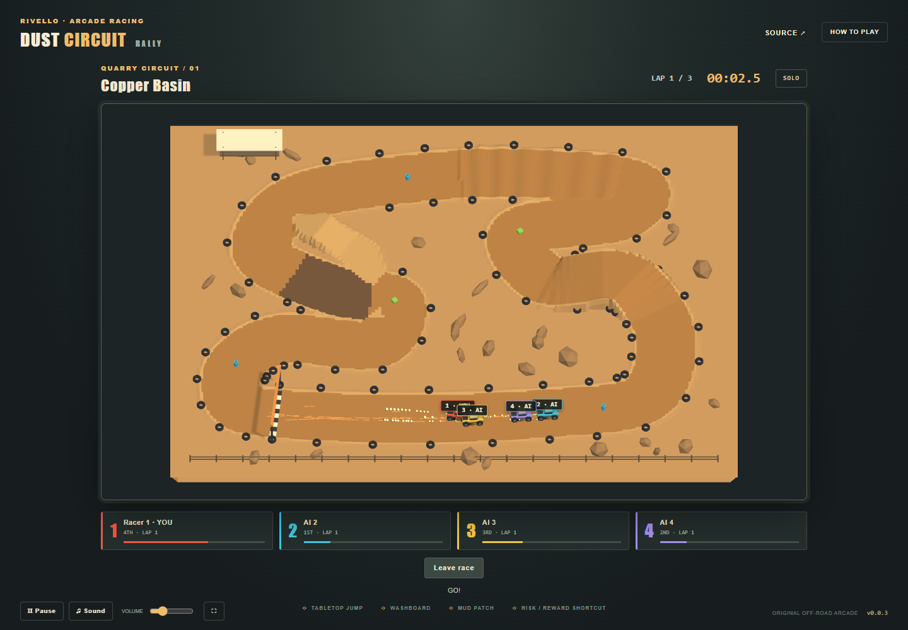

# Dust Circuit Rally

An original four-truck browser arcade racer with a fixed 16:9 landscape camera, solo practice, shared-screen racing, and online racing on the released shared server.

Original Blender artwork is integrated. Requires Chrome or Edge with WebGPU and hardware acceleration.

## Live Demo

[**Play Dust Circuit Rally**](https://samuelasherrivello.github.io/babylon-lite-super-offroad-clone/) — solo practice, local 2–4 players, or online racing with up to four humans.

[Game release v0.0.3](https://github.com/SamuelAsherRivello/babylon-lite-super-offroad-clone/releases/tag/v0.0.3). The public page, all eight runtime GLBs, solo/local races, two-browser online results, replay and landscape touch controls passed verification. The displayed version matches the release.

## Preview



This is the running WebGPU game with the exported Blender course and trucks. The generated art target in art-direction/target-v1/ is a design reference. Genuine Blender renders and editable sources are in project-name/artwork/.

## Getting Started

Use Node 24 and npm. Current Chrome/Edge with WebGPU and hardware acceleration is required. Commands run from the repository root.

```sh
npm ci
npm run dev -- --port 5188
npm test
node project-name/test/assets.mjs
npm run build
```

Open http://127.0.0.1:5188/babylon-lite-super-offroad-clone/. Solo/local simulation needs no game server after assets load; dependency installation needs network access. The optional ?graybox=1 query explicitly enables the earlier development geometry.

For browser verification, build, run `npm run preview -- --port 5189`, and set `GAME_URL` to the preview URL before `npm run test:browser`. Also run `node project-name/test/browser-input-network.mjs` against that URL. The browser suites use installed Google Chrome and emulated keyboard/touch; physical controller validation is not implied.

Format edited sources with `npm exec --yes --package=prettier@3.6.2 -- prettier --write project-name/src/*.js project-name/test/*.mjs project-name/index.html project-name/src/style.css`.

## Controls and Rules

| Control | Keyboard P1 | Keyboard P2 | Gamepad |
| --- | --- | --- | --- |
| Accelerate | W | Up | RT or A |
| Steer | A / D | Left / Right | Left stick |
| Brake / reverse | S | Down | LT |
| Nitro | Space | Enter | B |
| Recover | R | Backspace | Y |

Touch buttons allow simultaneous steering, gas, and nitro. Local racing starts with two keyboard racers; additional racers require separate gamepads. Shared pause freezes offline simulation. Online pause releases only your controls.

Copper Basin runs three laps with four equal trucks, AI fillers, a three-second countdown, a 120-second limit, and up to 15 seconds for remaining finishers. Ordered forward checkpoints validate progress. Recovery returns to the last checkpoint, clears velocity, and costs 1.25 seconds. Nitro starts at three seconds, refills 1.5 seconds up to five; grip lasts five seconds. Pickups respawn after eight seconds and the first authoritative collector wins.

Online admission uses dust-circuit-rally on the shared server. Up to four humans connect; the lowest occupied seat starts after everyone is ready. Late arrivals watch and enter the next race. Departures become AI for that race. Reconnect creates a fresh participant. In-memory hosting interruptions may reset races; progress is not durable. Mixed local/online parties, accounts, private rooms, championships, and upgrades are excluded.

## Project Details

- Babylon Lite 1.32.0 with WebGPU; Vite 8; DOM UI and original synthesized audio.
- Shared racing track/simulation imported from the exact released multiplayer client 0.6.0 artifact, not copied rules.
- Server simulation 30 Hz, snapshots 20 Hz, input 20 Hz; local prediction/reconciliation and remote smoothing.
- Fixed orthographic camera, whole-course landscape view; narrow layouts preserve 16:9.
- project-name/ deliberately remains the app root as required by generated AGENTS.md. Repository root is the npm root.
- Four template corner roles retained: title, links, settings, version. version.txt is the version source.
- Accepted arcade-racing specification is in openspec/specs/arcade-racing/; completed change is archived as 2026-09-30-build-dust-circuit-rally.

## Assets

The editable Blender source is [copper-basin.blend](project-name/artwork/copper-basin.blend). Nine scoped GLBs in project-name/public/assets/ contain the course, four numbered truck bodies, centered wheel, reusable prop kit and two pickups. The representative truck/tabletop prototype and full-course render are in project-name/artwork/. [Export/reimport audit](project-name/artwork/reimport-audit.json) records actual dimensions and materials.

The source uses meters. Game axes are +Y up, X/Z ground; trucks face +Z. The export root cancels Lite's default X reflection; mirrored-mesh support preserves winding. Wheels rotate around their centered X axle; front steering, chassis lean/pitch, suspension and pickups animate at runtime. Materials use export-compatible PBR colors. Seed 307 controls quarry scatter. Track contract and terrain samples are recorded in art-direction/track-v1.json, derived from the released shared track definition.

Original geometry was authored through the configured official Blender MCP in a private background scene using a reviewed, bounded, windowless runner. Existing editors and preferences were preserved. Course and truck export copies merge by material while the source retains editable objects. The course has 111,408 triangles and ten material primitives; each truck body has five primitives. All nine GLBs total approximately 5.8 MB. Lighting uses warm sun, cool ambient fill, 1024px PCF shadows and inexpensive contact effects. Dust is capped at 80 instances and skids at 120. The real game was inspected against the concept target; terrain folding, paint contrast, coordinate alignment and shadow registration were corrected. See [asset review](project-name/artwork/asset-review.md) for measured cost and remaining art differences.

## Verification and Delivery

npm test checks independent keyboard/gamepad mappings and the released offline race loop. project-name/test/browser.mjs drives complete solo, local and online races through keyboard input and captures actual game evidence. project-name/test/browser-input-network.mjs checks concurrent touch and a native WebSocket delay/drop/reconnect simulation. [Delivery status](project-name/documentation/delivery-status.md) records exact results and hardware limitations. `node project-name/test/assets.mjs` requires reviewed real GLB assets before release or Pages deployment.

The shared backend was released and live-verified as [v0.6.0](https://github.com/SamuelAsherRivello/rmc-colyseus-multiplayer-server/releases/tag/v0.6.0), including all 23 regression tests. [Release/deployment run](https://github.com/SamuelAsherRivello/rmc-colyseus-multiplayer-server/actions/runs/36695393931). The exact client artifact is pinned in package.json and package-lock.json.

Public verification on 2026-09-30 ran against the server's newer v0.7.0 deployment with the pinned v0.6.0 client. Solo/local races averaged 49.90/54.05 FPS; two simultaneous online browsers averaged 22.81 FPS. Online test drivers reached synchronized results with two laps each and were correctly ranked DNF behind the AI finishers. No page errors or failed requests occurred. All 27 current backend regressions passed. Physical mobile hardware and physical gamepads remain untested; touch and controller checks use emulation. See [public race evidence](project-name/documentation/public-browser-verification.json), [input/network evidence](project-name/documentation/input-network-verification.json) and [actionable error checks](project-name/documentation/error-verification.json).

Game release uses the checked-in Release workflow: install, tests, reviewed-asset check, build, patch version bump, commit, tag, GitHub release. Pages uses the deploy-pages workflow on main or explicit dispatch. After release, dispatch Pages if the bot version commit did not trigger it. [Release run](https://github.com/SamuelAsherRivello/babylon-lite-super-offroad-clone/actions/runs/36721392105) and [v0.0.3 deployment](https://github.com/SamuelAsherRivello/babylon-lite-super-offroad-clone/actions/runs/36721641521) succeeded. Public asset/version evidence is recorded in project-name/documentation/public-assets-verification.json.

## Source Revisions

| Source | Revision |
| --- | --- |
| GitHub repository template | 497d9e911cfcb04c9d20134ae3001a75d8a8ac15 |
| Shared skills library | 46e087b |
| Shared racing implementation | 220b92e |
| Backend release synchronization | 269e6c8 / v0.6.0 |

The repository was created through GitHub template generation as required by the game-creator skill and AGENTS.md. No source history was cloned into this game. Library skills were imported as real files; OpenSpec skills were regenerated with 1.13.1. Unrelated global skills were not overwritten.

## Original AI Prompt

<details>
<summary>Approved game prompt and execution follow-ups</summary>

```text
$rmc-game-creator

Create and deliver “Dust Circuit Rally,” an original browser-based 3D arcade off-road racing game with one polished circuit, four trucks, online multiplayer, local multiplayer, and solo practice.

Prioritize excellent handling, a readable fixed-camera race, cohesive Blender artwork, and reliable multiplayer. Complete and verify this scope before adding optional systems.

PROJECT AND REFERENCES

- Display title: Dust Circuit Rally
- Game identifier: dust-circuit-rally
- Intended repository: babylon-lite-super-offroad-clone
- Inspect the current workspace and remote. Continue the existing project if initialized; otherwise follow the required template workflow while preserving unrelated files.
- Use Babylon Lite with WebGPU and the rmc-game-creator template, OpenSpec, documentation, verification, and release workflows.

References:
- Gameplay and presentation: https://en.wikipedia.org/wiki/Super_Off_Road
- Blender skills: https://github.com/SamuelAsherRivello/ai-skills-blender/
- Shared multiplayer backend: https://github.com/SamuelAsherRivello/rmc-colyseus-multiplayer-server

Capture the classic arcade experience: the whole dirt circuit visible at once, chunky trucks, vehicle-relative steering, lively sliding and bouncing, short jumps, close contact, limited nitro, and quick rematches.

Create original vehicles, track topology, artwork, sounds, names, and UI. References guide genre and presentation; do not reproduce branded content or an existing track layout.

ONE CIRCUIT AND FIXED CAMERA

Build one original quarry circuit named “Copper Basin.”

Use a fixed orthographic elevated three-quarter camera with clear depth cues. Every legal route and landing must remain visible. Never follow a truck, rotate during play, zoom toward a racer, or shake the camera.

Override the creator skill’s portrait default with a 16:9 landscape play area. Fit the complete course on narrow displays through letterboxing and responsive UI. Keep controls, markers, and scenery from obscuring racing lines.

Begin with an approximately 80 × 60 m arena and tune scale through driving tests. Include:
- Start/finish straight with four staggered grid positions.
- Broad sweeping turn, tight hairpin, and S-bend.
- One tabletop jump with a clearly visible landing.
- Short washboard section with readable suspension bounce.
- Shallow mud patch that reduces speed and traction.
- One legal shortcut with a difficult entry or jump.
- Forgiving boundaries and safe recovery locations.
- Restrained quarry scenery outside the racing surface.

Keep passing space approximately three truck widths wide where practical. Distinguish the track, legal shortcut, infield, and out-of-bounds areas clearly. Avoid tunnels, overlapping roads, blind landings, and tall foreground scenery.

ART DIRECTION AND ASSET BRIEF

Use cohesive stylized low-poly 3D:
- Warm ochre dirt, cool shadows, restrained quarry scenery.
- Saturated truck colors with large readable numbers.
- Strong silhouettes, broad material regions, and selective bevels.
- Dust and skid effects that communicate motion without hiding racers.
- Simple lighting and shadows that reveal height and contact.

Create these Blender assets:
1. One original compact off-road truck, initially about 3.2 m long, with four color-and-number variants and equal base performance.
2. Separate chassis and wheels, front steering pivots, and wheel origins centered on their axles.
3. Complete terrain/circuit, including jump, washboard, mud, and berms.
4. Reusable tire stacks, barriers, fencing, three rock variants, start/finish gantry, and one small spectator structure.
5. Two visually distinct pickups: nitro refill and temporary traction boost.

Use runtime animation for wheel rotation, steering, chassis lean, suspension bounce, and pickup rotation where appropriate. Use lightweight runtime effects for dust, skids, collisions, landings, and pickup collection.

Add original engine, skid, boost, collision, pickup, countdown, and finish sounds. Provide mute and volume controls, and initialize audio after user interaction.

BLENDER WORKFLOW

Discover and read the relevant installed skills by name:
- blender-setup
- blender-create-model
- blender-create-environment
- blender-procedural-geometry
- blender-materials
- blender-light-camera
- blender-rig-animate
- blender-uv-bake
- blender-review-optimize
- blender-game-export
- blender-render

Use each when its work is needed. Follow the existing official Blender MCP connection and the skills’ visual-target feedback workflow. Coordinate one scene art direction and evaluate real previews at the final gameplay camera and display size.

Block out and test the course before creating detailed scenery. Develop the truck and one representative track section before expanding the asset kit.

Deliver editable .blend sources, GLB assets where supported by Babylon Lite, necessary textures, and genuine previews. Document scale, axes, pivots, object names, materials, and any animation clips.

Use export-compatible materials. Bake unsupported procedural features when needed. Verify scoped exports through reimport and actual Babylon Lite rendering. Set geometry, texture, and effect budgets from measured browser performance.

TRACK AND SIMULATION CONTRACT

Maintain one versioned track definition shared by server and client:
- Collision boundaries and drivable regions.
- Terrain heights, jump geometry, and surface effects.
- Ordered checkpoints and legal shortcut branches.
- Grid positions and safe recovery points.
- AI routes and pickup locations.

Derive or validate gameplay proxies against the Blender course. Ensure visible terrain, collision geometry, checkpoint routes, and server jump behavior agree.

Use lightweight vehicle simulation on the ground plane with explicit height/jump state. Visual wheel and suspension motion follows simulation state. Full rigid-body vehicle physics is outside this initial scope.

HANDLING AND INPUT

Provide responsive arcade controls:
- Left/right steering relative to truck heading.
- Accelerate and brake; holding brake near rest permits reverse.
- Limited nitro activated by a separate action.
- Controlled sliding with predictable grip recovery.
- Forgiving truck-to-truck and boundary collisions.
- Fast recovery from stuck or overturned states.

Nitro refills replenish a bounded supply. Traction boosts last a short defined duration. Specify pickup spawn, collection, respawn, and stacking rules in the design; validate them on the server.

Support keyboard, gamepad, and concurrent touch controls. Allow simultaneous steering, acceleration, and boost. Release inputs safely on focus loss, pointer cancellation, and controller disconnect.

RACE RULES

Each race has four trucks, with labeled AI filling unused positions.

Use three laps, target a 60–90 second race, and enforce a 120-second timeout. Tune track length and handling to meet this pace.

Implement a clear state flow:
Waiting → Countdown → Racing → Results → Waiting.

At countdown, freeze the roster and starting grid. Late arrivals wait for the next race. Start racers with equal performance, equal nitro, and reset pickup effects.

Validate checkpoint order, direction, shortcut branches, and finish-line crossings. Prevent lap credit from reversing across the line, skipping checkpoints, or using recovery to advance.

Recovery returns a truck to a safe point consistent with its last validated progress, clears unsafe velocity, and applies a short penalty.

After the first finisher, allow a brief finishing window bounded by the race timeout. Rank unfinished racers by validated lap, checkpoint, and progress along the legal route; use a deterministic tie-breaker.

Display positions, laps, nitro, pickup effects, results, and rematch controls. Identify racers using number and color, with a clear indicator for the local player.

Each race is independent. Exclude championships, currency, permanent upgrades, accounts, private room codes, and persistent progression from this version.

PLAY MODES

Online:
- One human per browser; up to four connected humans.
- Use the shared server’s existing admission pattern with the isolated dust-circuit-rally game identifier.
- Provide a simple waiting/ready screen using shared anonymous identities and seat indicators.
- The lowest occupied human seat may request a start; validate readiness on the server. Transfer that role when the player leaves.
- Permit one ready human to race against AI.
- Waiting participants count toward human capacity and receive full/error feedback.
- Late arrivals may view the current race and enter the next grid.
- Replace a disconnected racer with AI for the remainder of that race.
- Reconnect creates a fresh participant who waits for the next race.
- If all humans leave, clean up the session.

Local:
- Two to four humans on one shared screen.
- Support multiple gamepads and two-player keyboard sharing.
- Provide join/ready controls, distinct indicators, AI fillers, and shared pause.
- Run without a network connection.

Solo:
- Offline practice against AI using the same course and handling.

Mixed local-and-online parties are outside this scope.

SHARED MULTIPLAYER SERVER

Follow the rmc-game-creator multiplayer workflow. Inspect the backend’s current AGENTS.md, feature catalog, game registry, shared-client API, source, tests, hosting evidence, and release/deployment workflows.

Reuse existing:
- Connection status, identity, occupancy, retry, subscriptions, and teardown.
- Generic game-state snapshots and messaging.
- Admission, capacity, input-expiration, and game-isolation patterns.
- Authoritative simulation examples, client packaging, and deployment verification.

Add:
- Four-human racing room.
- Authoritative truck simulation, collisions, terrain, jumps, nitro, and pickups.
- Race phases, readiness, grid formation, lap validation, ranking, and replay.
- Server-controlled AI and disconnect substitution.
- Sequenced input and acknowledgments needed for prediction.

Clients send bounded controls and allowed lifecycle requests. The server owns shared outcomes. Reject invalid, stale, excessive, or unauthorized messages; expire missing input.

Use a fixed simulation timestep, client prediction/reconciliation for the controlled truck, and interpolation for remote trucks. Begin with existing server rates and adjust only when measured responsiveness requires it.

Keep racing rules in the racing module. Add broadly reusable capabilities to the shared client through backward-compatible APIs, with regressions for existing consumers.

Respect current hosting limits. An interrupted in-memory race may reset. Show an interrupted-session state and reconnect into a fresh waiting room. Do not imply retained progress or silently replace online play with offline simulation.

Private matchmaking, persistent identity, durable storage, and hosting migration are future work.

IMPLEMENTATION ORDER AND ACCEPTANCE

1. Inspect the project, skills, renderer, and server. Record the design, contracts, assumptions, and acceptance criteria in OpenSpec.
2. Implement and test the racing server contract. Release and verify backend support before integrating the game client with the exact released shared-client artifact.
3. Build the graybox circuit and handling. Verify full-course framing, legal routes, race completion, AI, and recovery.
4. Create and integrate Blender assets. Compare gameplay-camera previews and refine visible shortcomings.
5. Complete controls, audio, HUD, connection states, results, and replay.
6. Run applicable checks, production builds, browser verification, releases, and public deployment checks.

Verify:
- Complete solo and local races with independent simultaneous input.
- Complete online race with two independent browser sessions.
- Four-human capacity and fifth-player rejection.
- Readiness, late arrival, disconnect substitution, fresh reconnect, and replay.
- Contested pickups, checkpoint exploits, jumps, recovery, and finish ordering.
- Simulated latency, dropped connections, stale input, and invalid actions.
- Shared-server game isolation and existing-game regressions.
- Keyboard, gamepad, touch, resize, audio initialization, and teardown.
- Full-course visibility and readable racing on desktop and narrow layouts.
- Actual asset imports, browser performance, console errors, and production paths.
- Public game client and released backend working together.

When this prompt is executed, complete the scoped server and game releases and GitHub Pages delivery required by rmc-game-creator.

Return the playable URL, repository and release links, editable asset locations, actual gameplay screenshots, measured performance, completed checks, and specific remaining limitations. Distinguish verified behavior from untested behavior.
```

Execution follow-ups, quoted separately:

```text
use the prompt and build the game
use landscape view for the game
```

These follow-ups authorize execution and retain landscape framing; the attachment's introductory 'prompt only' note was superseded by the build request.

</details>

## Credits

<!-- AI: Do not add more than one sentence of introductory text at the top of this section. -->

<!-- AI: Preserve established attribution and ownership. Customize the following subsections only from confirmed contributor, contact, and license information; do not infer a new owner from the repository name. -->
### 💡 Contributors

<!-- AI: Do not add more than one sentence of introductory text at the top of this section. -->

<!-- AI: Preserve existing contributor credit and add contributors only when confirmed. Do not automatically advance experience counts or their reference year. -->
- Samuel Asher Rivello - Over 25 years of game development XP (2026)

### 💡 Contact

<!-- AI: Do not add more than one sentence of introductory text at the top of this section. -->

<!-- AI: Preserve confirmed contact destinations and their order unless requested otherwise. Use readable display URLs without a protocol or trailing slash while keeping the real link target intact. Do not invent accounts or change target capitalization based on display styling. -->
- [LinkedIn.com/in/SamuelAsherRivello](https://Linkedin.com/in/SamuelAsherRivello) ⭐ 
- [GitHub.com/SamuelAsherRivello](https://github.com/SamuelAsherRivello/)
- [Twitter.com/srivello](https://twitter.com/srivello/)
- Resume / Portfolio: [SamuelAsherRivello.com](http://www.SamuelAsherRivello.com)


### 💡 License

<!-- AI: Do not add more than one sentence of introductory text at the top of this section. -->

<!-- AI: Keep the license name linked to the actual relative license file and verify that its terms match this statement. Keep the copyright holder and year consistent with that file. Do not change license terms, ownership, or dates without an explicit request. -->
- Provided as-is under the [MIT License](LICENSE).

- Copyright © 2026 Rivello Multimedia Consulting, LLC.
